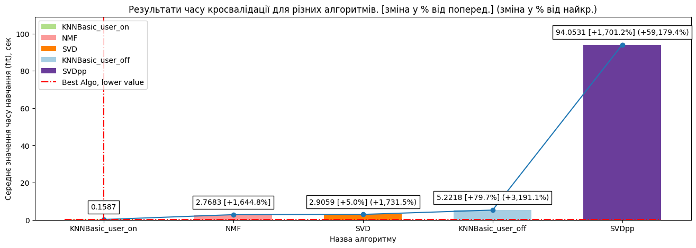
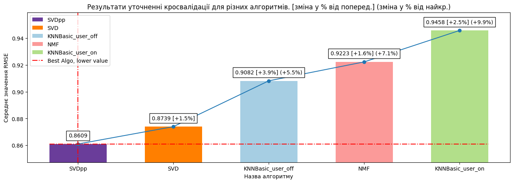
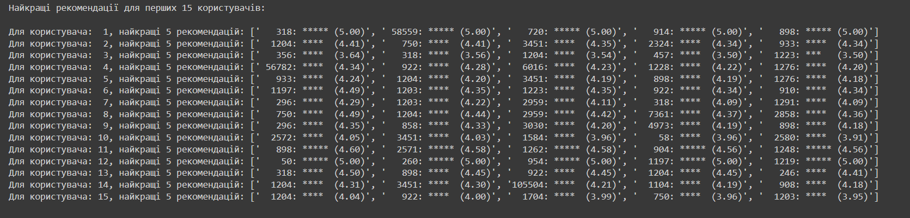
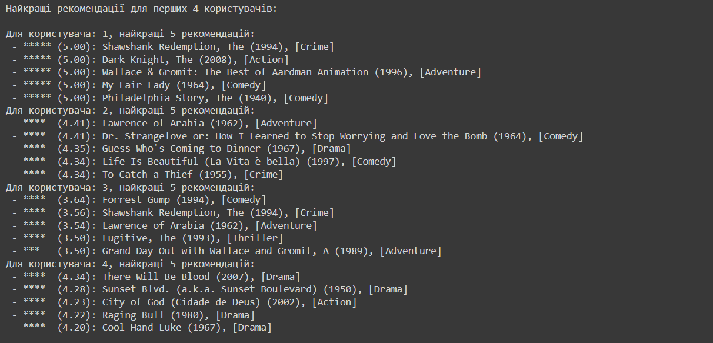
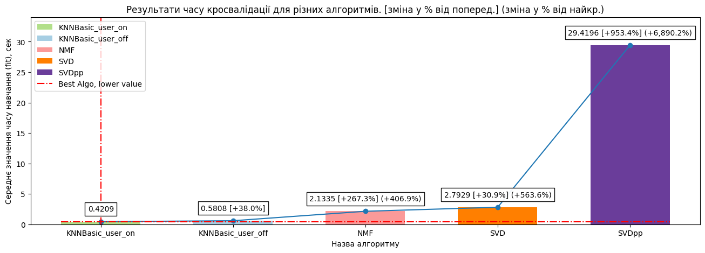
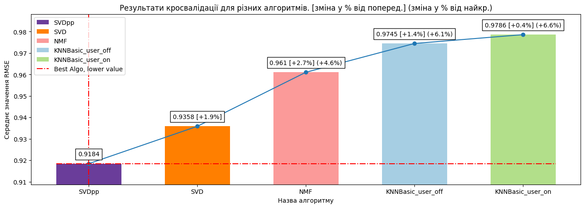
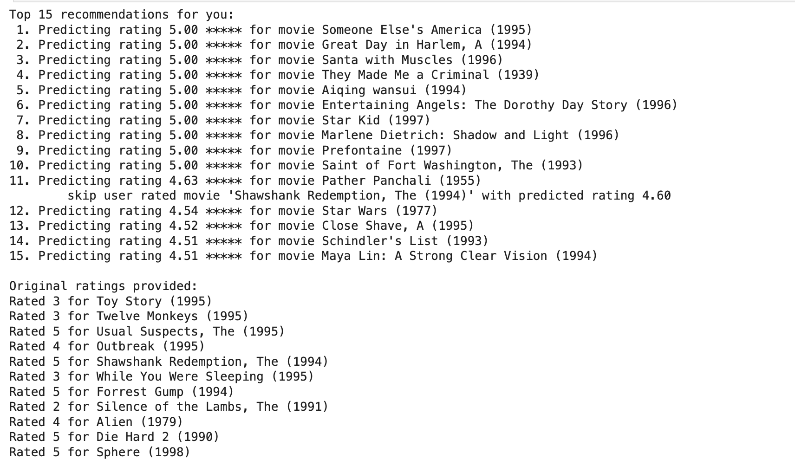

# Модуль 7. Рекомендаційні системи.

*З циклу [домашніх завдань Python Data Science](https://github.com/lexxai/goit_python_data_sciense_homework).*

# Домашнє завдання

На цьому тижні ми вивчили як працюють рекомендаційні системи. Пропонуємо вам познайомитись з бібліотекою [surprise](https://surpriselib.com/), котра якраз є по суті додатком до знайомої нам бібліотеки scikit-learn для тренування моделей рекомендаційних систем.

Візьміть датасет [movielens](https://surprise.readthedocs.io/en/stable/dataset.html) і побудуйте модель матричної факторизації. У даній бібліотеці він має назву SVD. Підберіть найкращі параметри за допомогою крос-валідації, також поекспериментуйте з іншими [алгоритмами](https://surprise.readthedocs.io/en/stable/prediction_algorithms_package.html) розрахунків (SVD++, NMF) і оберіть той, який буде оптимальним.

Підказки як саме побудувати дану модель ви знайдете в документації до даної бібліотеки.

# Додаткове завдання з зірочкою

Для більшого заглиблення в роботу алгоритму, пропонуємо реалізувати алгоритм колабораційної фільтрації з нуля. Для цього ми можемо скористатись нашою [домашньою роботою з 3-ого модуля](https://github.com/lexxai/goit_python_ds_hw_03). Якщо ми модифікуємо функцію втрат та розрахунок градієнтів, то зможемо побудувати алгоритм матричної факторизації.

[Тут](https://colab.research.google.com/drive/1biZdo4pc_Kkm-JvZsuadqDVphfUu1sGk?usp=sharing) ви можете побачити формули та завантаження датасету. А ось посилання на [назви фільмів](https://drive.google.com/file/d/12XeO4KXQfbvvTdLFbkYA-BeXzhlNnnuo/view?usp=sharing) та на [рейтинги](https://drive.google.com/file/d/17V9OhXeZH9Wv17Nkh-Tqxa8svEmRZcIp/view?usp=sharing).

Вдалої роботи!

# Результати

 Використання *load_from_df* та "ratings.csv" з ["ml-latest-small.zip"](https://files.grouplens.org/datasets/movielens/ml-latest-small.zip)
- [goit_python_ds_hw_07.ipynb](goit_python_ds_hw_07.ipynb)
- [Colab (goit_python_ds_hw_07.ipynb)](https://colab.research.google.com/drive/16d9XjLMiamutwolBhrWSo5ZDOwubPk4W?usp=sharing)

Швидші розрахунки у 3.28 рази при використанні *load_builtin* у порівнянні з "ratings.csv" для SVD++

- [goit_python_ds_hw_07_load_builtin.ipynb](goit_python_ds_hw_07_load_builtin.ipynb)
- [Colab (goit_python_ds_hw_07_load_builtin.ipynb)](https://colab.research.google.com/drive/1th6gp6ob24eAtASWa_9NpaAfJ6bPaZy-?usp=sharing)

## Частина 2 (бонус)
 - [goit_python_ds_hw_07_part_2.ipynb](goit_python_ds_hw_07_part_2.ipynb)
 - [Colab goit_python_ds_hw_07_part_2.ipynb](https://colab.research.google.com/drive/1myC3JIWZd0keXvuGB6WA3h2Njxtf4LYi?usp=sharing)

